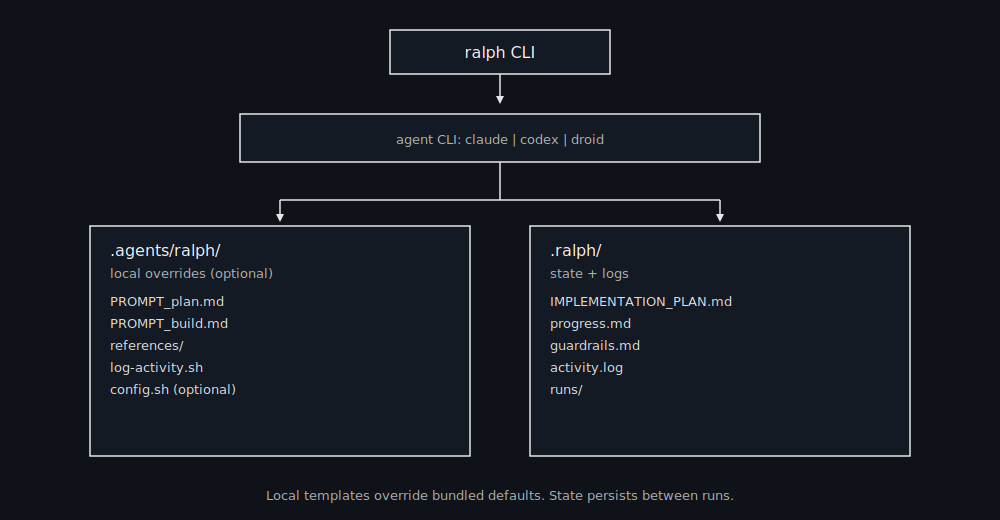

# Ralph CLI


Ralph is a minimal, file-based agent loop for autonomous coding. Each iteration starts fresh, reads on-disk state, and commits work for one story at a time.

## Quick Start (5 minutes)

### Prerequisites

- Node.js 18+
- Git
- An AI agent: [Claude Code](https://claude.ai/download), [Codex](https://github.com/openai/codex), or [Droid](https://factory.ai)

### Install Ralph

```bash
git clone https://github.com/AskTinNguyen/ralph-cli.git
cd ralph-cli
npm install && npm link
```

### Use in Your Project

```bash
cd your-project
ralph install          # Install templates
ralph prd              # Generate requirements (interactive)
ralph plan             # Create implementation plan
ralph build 5          # Run 5 build iterations
```

That's it! Ralph will execute your plan one story at a time.

## How It Works

Ralph treats **files and git** as memory, not the model context:

- **PRD** defines what's required
- **Plan** breaks it into concrete tasks
- **Loop** executes one story per iteration
- **State** persists in `.ralph/`



## Installation

### From GitHub (Recommended)

```bash
git clone https://github.com/AskTinNguyen/ralph-cli.git
cd ralph-cli
npm install && npm link
```

### From npm (Alternative)

```bash
npm install -g github:AskTinNguyen/ralph-cli
```

### Install Templates to Your Project

```bash
ralph install
```

This creates `.agents/ralph/` in your project so you can customize prompts and loop behavior. You'll be asked if you want to add optional skills.

### Install Skills (Optional)

```bash
ralph install --skills
```

You'll be prompted for agent (codex/claude/droid) and scope (local/global). Skills installed: **commit**, **dev-browser**, **prd**.

## Basic Workflow

### 1. Generate PRD

```bash
ralph prd
```

Example prompt:

```
A lightweight uptime monitor (Hono app), deployed on Cloudflare, with email alerts via AWS SES
```

### 2. Create Plan

```bash
ralph plan
```

Generates `.ralph/PRD-1/plan.md` with ordered stories from your PRD.

### 3. Run Build Iterations

```bash
ralph build 5          # Run 5 iterations
ralph build 1 --no-commit   # Dry run (no commits)
```

Each iteration picks the next unchecked story, executes it, commits, and marks it done.

### Override Paths

```bash
ralph plan --prd docs/prd-api.md --plan .ralph/api-plan.md
ralph build 1 --prd docs/prd-api.md --plan .ralph/api-plan.md
ralph build 1 --progress .ralph/progress-api.md
```

## Multi-Stream (Parallel Execution)

Work on multiple features simultaneously using isolated git worktrees.

### When to Use

- Building 2+ independent features at once
- Testing different approaches in parallel
- Maximizing throughput on large projects

### Workflow

```bash
# 1. Create streams (one per feature)
ralph stream new                    # Creates PRD-1
ralph stream new                    # Creates PRD-2

# 2. Edit your PRDs
# → .ralph/PRD-1/prd.md (Feature A)
# → .ralph/PRD-2/prd.md (Feature B)

# 3. Initialize isolated worktrees
ralph stream init 1
ralph stream init 2

# 4. Run builds in parallel
ralph stream build 1 5 &            # 5 iterations on PRD-1
ralph stream build 2 5 &            # 5 iterations on PRD-2
wait                                # Wait for both

# 5. Check progress
ralph stream status

# 6. Merge completed work
ralph stream merge 1
ralph stream merge 2

# 7. Clean up
ralph stream cleanup 1
ralph stream cleanup 2
```

### Commands Reference

| Command                  | Description                   |
| ------------------------ | ----------------------------- |
| `ralph stream new`       | Create new PRD-N folder       |
| `ralph stream list`      | List all streams with status  |
| `ralph stream status`    | Detailed status table         |
| `ralph stream init N`    | Create worktree for stream N  |
| `ralph stream build N X` | Run X iterations on stream N  |
| `ralph stream merge N`   | Merge stream N to main branch |
| `ralph stream cleanup N` | Remove worktree for stream N  |

## Configuration

### Choose the Agent Runner

Set in `.agents/ralph/config.sh`:

```bash
AGENT_CMD="codex exec --yolo -"
AGENT_CMD="claude -p --dangerously-skip-permissions"
AGENT_CMD="droid exec --skip-permissions-unsafe -f {prompt}"
```

Or override per run:

```bash
ralph build 1 --agent=codex
ralph build 1 --agent=claude
ralph build 1 --agent=droid
```

If the CLI isn't installed, Ralph prints install hints:

```
codex  -> npm i -g @openai/codex
claude -> curl -fsSL https://claude.ai/install.sh | bash
droid  -> curl -fsSL https://app.factory.ai/cli | sh
```

## File Structure

```
project/
├── .agents/ralph/              # Templates (customizable)
│   ├── loop.sh                 # Main execution loop
│   ├── stream.sh               # Multi-stream commands
│   ├── config.sh               # Configuration overrides
│   ├── agents.sh               # Agent command definitions
│   └── PROMPT_*.md             # Prompt templates
└── .ralph/                     # State (per-project)
    ├── PRD-1/                  # First plan (isolated)
    │   ├── prd.md              # Requirements document
    │   ├── plan.md             # Implementation plan
    │   ├── progress.md         # Progress log
    │   └── runs/               # Run logs
    ├── PRD-2/                  # Second plan (isolated)
    ├── guardrails.md           # Shared lessons learned
    └── worktrees/              # Git worktrees for parallel execution
```

### Template Hierarchy

Ralph looks for templates in this order:

1. `.agents/ralph/` in your project (if present)
2. Bundled defaults shipped with the CLI

State and logs always go to `.ralph/` in your project.

## State Files

| File            | Purpose                              |
| --------------- | ------------------------------------ |
| `prd.md`        | Requirements and acceptance criteria |
| `plan.md`       | Task plan grouped by story           |
| `progress.md`   | Append-only progress log             |
| `guardrails.md` | Lessons learned ("Signs")            |
| `activity.log`  | Activity + timing log                |
| `errors.log`    | Repeated failures and notes          |
| `runs/`         | Raw run logs + summaries             |

## Tests

```bash
# Dry-run smoke tests (no agent required)
npm test

# Fast agent health check
npm run test:ping

# Optional integration test (requires agents installed)
RALPH_INTEGRATION=1 npm test

# Full real-agent loop test
npm run test:real
```

## Notes

- `.agents/ralph` is portable and can be copied between repos
- `.ralph` is per-project state (add to `.gitignore`)
- Use `{prompt}` in `AGENT_CMD` when the agent needs a file path instead of stdin
- Each `ralph plan` creates a new PRD-N folder (plans are never overwritten)
