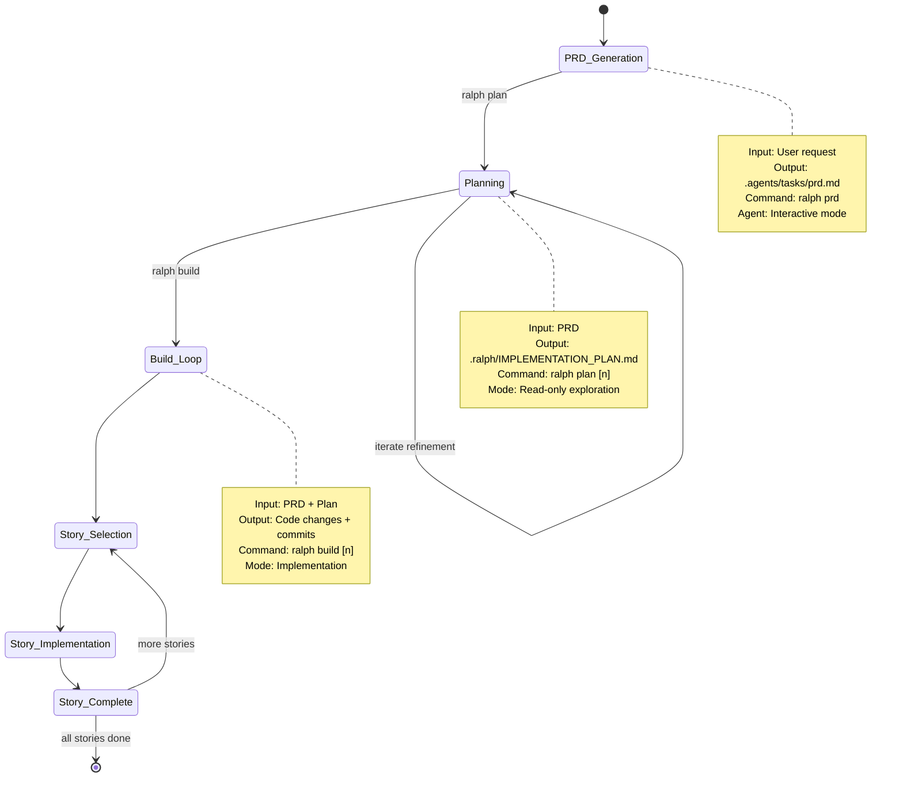
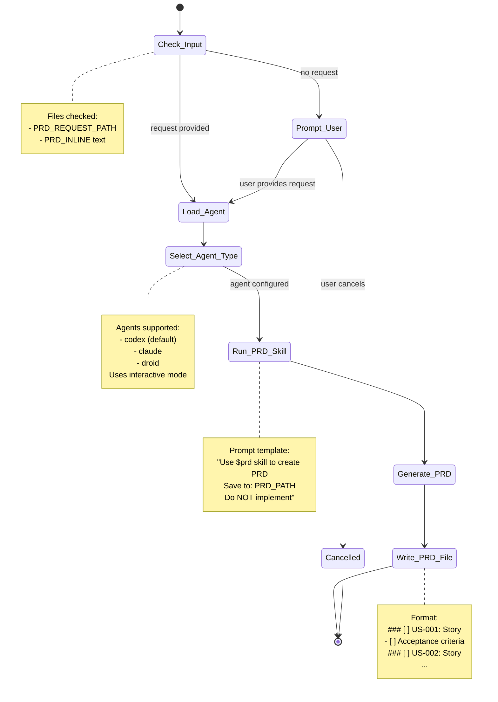
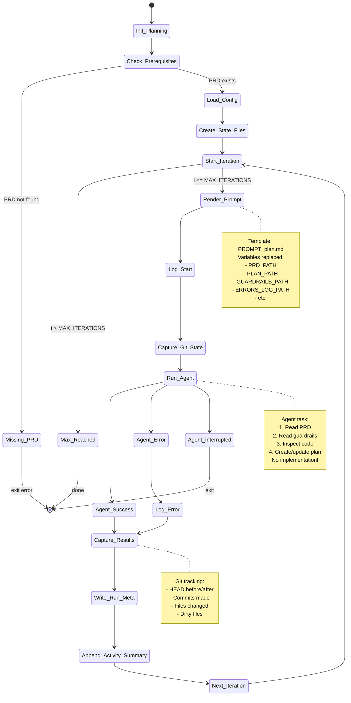
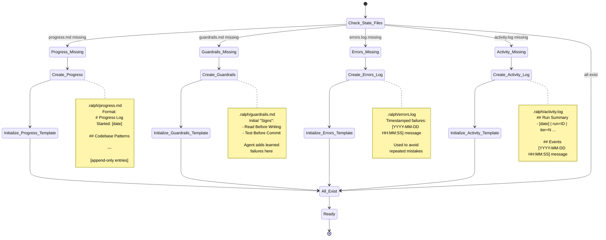
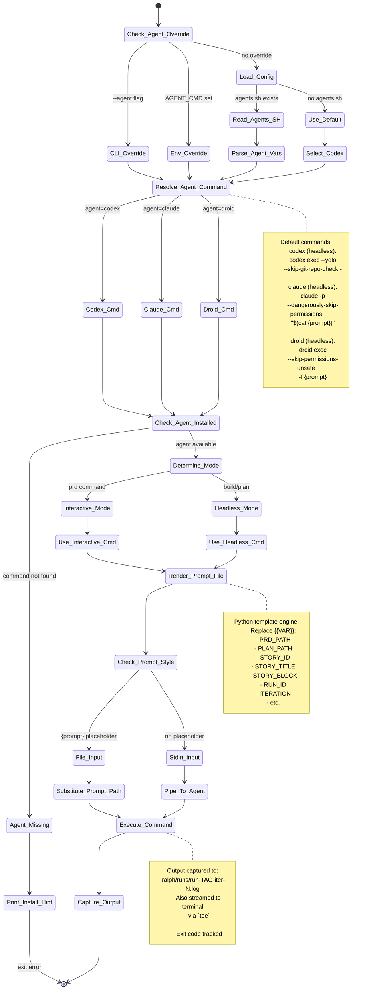

# Ralph State Machine Diagrams

This document explains how Ralph works through state machine diagrams.

## 1. High-Level System State Machine

Ralph operates in three main modes that form a sequential workflow:



## 2. PRD Generation State Machine



## 3. Planning Iteration State Machine



## 4. Build Iteration State Machine (Story-Based)

```mermaid
stateDiagram-v2
    [*] --> Init_Build

    Init_Build --> Check_Prerequisites
    Check_Prerequisites --> Missing_PRD: PRD missing
    Check_Prerequisites --> Missing_Plan: Plan missing
    Check_Prerequisites --> Load_Config: All files exist

    Missing_PRD --> [*]: exit error
    Missing_Plan --> [*]: exit error

    Load_Config --> Create_State_Files
    Create_State_Files --> Start_Iteration

    Start_Iteration --> Max_Reached: i > MAX_ITERATIONS
    Start_Iteration --> Select_Story: i <= MAX_ITERATIONS

    Select_Story --> Parse_Stories
    Parse_Stories --> No_Stories: parsing failed
    Parse_Stories --> All_Done: remaining = 0
    Parse_Stories --> Story_Found: remaining > 0

    No_Stories --> [*]: exit error
    All_Done --> [*]: success

    Story_Found --> Extract_Story_Block
    Extract_Story_Block --> Render_Prompt

    Render_Prompt --> Log_Start
    Log_Start --> Capture_Git_Before
    Capture_Git_Before --> Run_Agent

    Run_Agent --> Agent_Success
    Run_Agent --> Agent_Error
    Run_Agent --> Agent_Interrupted

    Agent_Interrupted --> [*]: exit

    Agent_Success --> Check_Completion_Signal
    Agent_Error --> Log_Error_Event

    Log_Error_Event --> Check_Uncommitted

    Check_Completion_Signal --> Complete_Signal: <promise>COMPLETE</promise>
    Check_Completion_Signal --> Check_Uncommitted: no signal

    Complete_Signal --> Verify_All_Done
    Verify_All_Done --> [*]: all stories checked
    Verify_All_Done --> Continue: stories remain

    Check_Uncommitted --> Uncommitted_Warning: dirty files & !NO_COMMIT
    Check_Uncommitted --> Capture_Git_After: clean or NO_COMMIT

    Uncommitted_Warning --> Log_Warning
    Log_Warning --> Capture_Git_After

    Capture_Git_After --> Write_Run_Meta
    Write_Run_Meta --> Append_Activity_Summary
    Append_Activity_Summary --> Recheck_Stories

    Recheck_Stories --> Next_Iteration
    Continue --> Next_Iteration

    Next_Iteration --> Start_Iteration

    Max_Reached --> [*]: max iterations

    note right of Parse_Stories
        Pattern:
        ### [status] US-NNN: Title

        Status:
        - [ ] = pending
        - [x] = done
    end note

    note right of Extract_Story_Block
        Extracts:
        - Story ID (US-NNN)
        - Story title
        - All lines until next story

        Selects first unchecked story
    end note

    note right of Run_Agent
        Agent workflow:
        1. Read guardrails
        2. Read errors log
        3. Read PRD
        4. Read plan section for story
        5. Audit code
        6. Implement story
        7. Run verification
        8. Update plan (mark tasks)
        9. Update PRD (check criteria)
        10. Commit (if !NO_COMMIT)
        11. Append to progress.md
    end note

    note right of Check_Completion_Signal
        Completion signal:
        <promise>COMPLETE</promise>

        Only when ALL stories
        in PRD are checked [x]
    end note
```



## 5. Story Implementation Workflow (Agent Perspective)

```mermaid
stateDiagram-v2
    [*] --> Read_Guardrails

    Read_Guardrails --> Read_Errors_Log
    Read_Errors_Log --> Read_PRD
    Read_PRD --> Read_Plan

    Read_Plan --> Story_In_Plan: story section exists
    Read_Plan --> Create_Story_Section: no section

    Create_Story_Section --> Audit_Code
    Story_In_Plan --> Audit_Code

    Audit_Code --> Read_All_Files
    Read_All_Files --> Understand_Context
    Understand_Context --> Read_Agents_MD: AGENTS.md exists
    Understand_Context --> Implement: no AGENTS.md

    Read_Agents_MD --> Implement

    Implement --> Run_Verification
    Run_Verification --> Verification_Pass
    Run_Verification --> Verification_Fail

    Verification_Fail --> Debug_Fix
    Debug_Fix --> Run_Verification

    Verification_Pass --> Update_Plan
    Update_Plan --> Mark_Tasks_Done
    Mark_Tasks_Done --> Update_PRD_Criteria

    Update_PRD_Criteria --> All_Criteria_Done: all acceptance criteria checked
    Update_PRD_Criteria --> Some_Pending: some pending

    Some_Pending --> Should_Commit: work done
    All_Criteria_Done --> Mark_Story_Complete

    Mark_Story_Complete --> Should_Commit

    Should_Commit --> Skip_Commit: NO_COMMIT = true
    Should_Commit --> Stage_Changes: NO_COMMIT = false

    Skip_Commit --> Write_Progress_Entry

    Stage_Changes --> Git_Add_All
    Git_Add_All --> Commit_Changes
    Commit_Changes --> Verify_Clean

    Verify_Clean --> Working_Tree_Dirty: git status shows files
    Verify_Clean --> Capture_Commit_Hash: clean

    Working_Tree_Dirty --> Log_Warning_Dirty
    Log_Warning_Dirty --> Write_Progress_Entry

    Capture_Commit_Hash --> Write_Progress_Entry

    Write_Progress_Entry --> Append_Progress
    Append_Progress --> Check_All_Stories

    Check_All_Stories --> All_Stories_Done: no unchecked stories
    Check_All_Stories --> Stories_Remain: unchecked stories exist

    All_Stories_Done --> Output_Complete_Signal
    Stories_Remain --> [*]

    Output_Complete_Signal --> [*]

    note right of Read_Guardrails
        File: .ralph/guardrails.md
        Contains "Signs" - lessons
        learned from failures
    end note

    note right of Audit_Code
        CRITICAL:
        "Do NOT assume missing
        functionality; confirm
        by reading code"
    end note

    note right of Update_PRD_Criteria
        Mark each criterion:
        - [ ] → - [x]

        Only mark story heading
        complete when ALL
        criteria are checked
    end note

    note right of Git_Add_All
        git add -A

        Includes:
        - Source code
        - PRD updates
        - Plan updates
        - Progress log
    end note

    note right of Output_Complete_Signal
        <promise>COMPLETE</promise>

        Triggers early exit
        from build loop
    end note
```



## 6. File State Management



## 7. Agent Selection & Execution



## Key Concepts

### Memory Model
Ralph treats **files and git** as memory, not model context:
- Each iteration starts fresh with a new agent session
- State persists only in files (`.ralph/` directory)
- Git commits serve as checkpoints

### Story Format
Stories in PRD must follow this exact pattern:
```markdown
### [ ] US-001: Story Title
- [ ] Acceptance criterion 1
- [ ] Acceptance criterion 2
```

When complete:
```markdown
### [x] US-001: Story Title
- [x] Acceptance criterion 1
- [x] Acceptance criterion 2
```

### State Files (.ralph/)
- `IMPLEMENTATION_PLAN.md` - Task plan grouped by story
- `progress.md` - Append-only progress log
- `guardrails.md` - "Signs" (lessons learned)
- `activity.log` - Activity + timing log
- `errors.log` - Repeated failures and notes
- `runs/` - Raw run logs + summaries

### Control Flow
1. **PRD Generation**: User request → Agent + skill → PRD file
2. **Planning**: PRD → Agent reads code → Creates implementation plan
3. **Build Loop**: For each story → Agent implements → Commits → Updates PRD/plan
4. **Completion**: When all stories marked `[x]` → `<promise>COMPLETE</promise>` → Exit

### Error Handling
- Non-zero exit codes logged to `errors.log`
- Uncommitted files after build iteration trigger warnings
- Guardrails updated with learned failures
- Iterations continue unless interrupted (SIGINT/SIGTERM)
