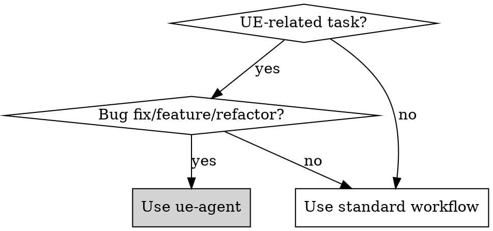
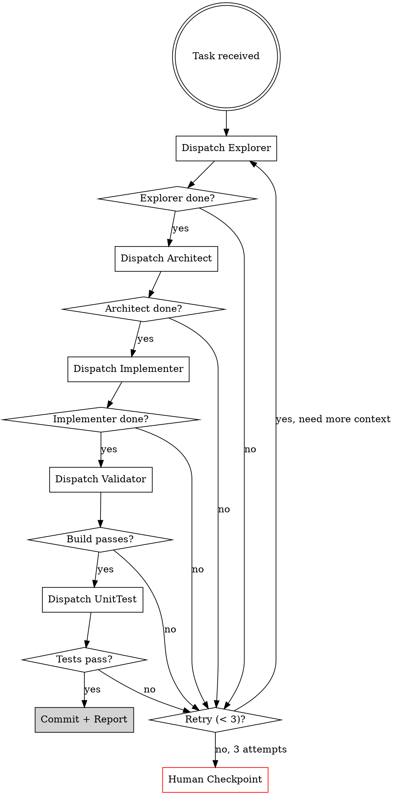

# ue-agent: Unreal Engine Multi-Agent Orchestrator

## Overview

Orchestrates 5 specialized agents to implement UE features with full autonomy. Engine source is **READ-ONLY reference**; all modifications go to game code only.

**Core constraint:** NEVER modify engine source. Find game-side solutions (override, intercept, validate).

## When to Use



**Use when:**
- Task involves Unreal Engine code (game or engine reference)
- Implementing gameplay systems, editor tools, plugins
- Fixing bugs that interact with engine APIs
- Refactoring UE-specific patterns (UPROPERTY, UFUNCTION, Subsystems)
- Migrating deprecated engine APIs

**Don't use for:**
- Pure content/asset work (use Editor)
- Non-UE codebases
- Documentation-only tasks

## Agent Architecture

```
┌─────────────────────────────────────────────────────────────────┐
│                    ORCHESTRATOR (Main Agent)                     │
│  Dispatches to specialists, aggregates results, handles errors  │
└─────────────────────────────────────────────────────────────────┘
           │
           ├──▶ [1] EXPLORER ──────▶ Context artifacts
           │         │
           │         ▼
           ├──▶ [2] ARCHITECT ─────▶ Implementation plan
           │         │
           │         ▼
           ├──▶ [3] IMPLEMENTER ───▶ Code changes
           │         │
           │         ▼
           ├──▶ [4] VALIDATOR ─────▶ Build + test results
           │         │
           │         ▼
           └──▶ [5] UNITTEST ──────▶ Generated tests + results
```

### Agent Responsibilities

| Agent | Input | Output | Max Attempts |
|-------|-------|--------|--------------|
| **Explorer** | Task description | Relevant code, docs, patterns | 3 |
| **Architect** | Explorer artifacts | Implementation plan | 3 |
| **Implementer** | Architect plan | Code changes (game repo only) | 3 |
| **Validator** | Changed files | Build result, test results | 3 |
| **UnitTest** | Implementation | Generated tests + pass/fail | 3 |

## Orchestration Flow



## The Iron Law

```
ENGINE SOURCE IS READ-ONLY. NEVER MODIFY ENGINE FILES.
```

**No exceptions:**
- Not for "just a quick fix"
- Not for "the bug is clearly in engine"
- Not for "it's faster than a workaround"
- Not for "I'll submit a PR to Epic later"

**Game-side solutions:**
- Override virtual functions in game classes
- Intercept with delegates/events
- Validate inputs before calling engine APIs
- Wrap engine functionality in game utilities

| Temptation | Game-Side Solution |
|------------|-------------------|
| "Fix crash in engine class" | Override method, add null check before `Super::` |
| "Add feature to engine subsystem" | Create game subsystem that composes engine one |
| "Change engine behavior" | Use config, delegates, or game-level intercept |
| "Patch deprecated API" | Wrap in game utility, migrate callers |

## Engine Detection

Skill auto-detects engine location via:
1. `UE_ROOT` environment variable
2. `EngineAssociation` in `.uproject` file
3. Sibling directory patterns (`../UnrealEngine`, `../UE_5.7`)

**First run:** If not found, prompts user once and caches in `.ralph/ue-config.json`.

## Agent Prompts

See `prompts/` directory for full agent prompts:
- `PROMPT_orchestrator.md` - Main coordinator
- `PROMPT_explorer.md` - Code/docs search
- `PROMPT_architect.md` - Implementation planning
- `PROMPT_implementer.md` - Code writing
- `PROMPT_validator.md` - Build/test validation
- `PROMPT_unittest.md` - Test generation

### Explorer Agent

**Goal:** Gather all relevant context before architecture.

**Search targets:**
1. **Game code** - Existing implementations, patterns, related classes
2. **Engine source** - API definitions, base classes, macros (READ-ONLY)
3. **Documentation** - In-repo markdown, design docs, comments
4. **Build files** - .Build.cs modules, dependencies

**Tools:** LSP (auto-discover clangd), Grep, Glob, Read

### Architect Agent

**Goal:** Design implementation approach using Explorer's findings.

**Output:** Implementation plan with files to modify (game code only), verification commands, risks.

### Implementer Agent

**Goal:** Execute Architect's plan. Modify ONLY game code.

**Constraints:**
- Follow Epic coding standards
- NEVER touch engine source paths
- Create feature branch: `feature/TASK-XXX-description`
- Small, focused commits

**Coding Standards (Epic):**
- PascalCase for types, functions
- Prefix: A (Actor), U (UObject), F (struct), E (enum), I (interface), T (template)
- UPROPERTY/UFUNCTION for reflection
- Include what you use
- Forward declare in headers

### Validator Agent

**Goal:** Compile and run existing tests.

**Build command:**
```bash
<EnginePath>/Build/BatchFiles/Build.bat <Target>Editor Win64 Development -Project="<ProjectPath>"
```

**Test command:**
```bash
<EnginePath>/Binaries/Win64/<Target>Editor.exe -ExecCmds="Automation RunTests <TestFilter>" -unattended -NullRHI
```

### UnitTest Agent

**Goal:** Generate AND run tests for the implementation.

**Template:**
```cpp
IMPLEMENT_SIMPLE_AUTOMATION_TEST(F<TestName>, "<Category>.<TestName>",
    EAutomationTestFlags::ApplicationContextMask | EAutomationTestFlags::ProductFilter)

bool F<TestName>::RunTest(const FString& Parameters)
{
    // Arrange
    // Act
    // Assert
    TestTrue(TEXT("Description"), Condition);
    return true;
}
```

## Error Handling

**3 attempts per agent, then human checkpoint.**

**Retry strategy:**
- Explorer fails → Expand search scope, try different terms
- Architect fails → Ask Explorer for more context
- Implementer fails → Review Architect plan, clarify ambiguity
- Validator fails → Parse errors, give Implementer specific fixes
- UnitTest fails → Simplify tests, focus on core behavior

**Human checkpoint prompt:**
```
Agent [X] failed after 3 attempts.
Last error: [error message]
Attempts made: [summary]

Options:
1. Provide guidance and retry
2. Skip this step
3. Abort task
```

## Ralph Integration

Uses Ralph flow: PRD → Plan → Build

**PRD enrichment:** Explorer auto-gathers context before Architect.

**Plan format:** Architect output becomes task breakdown in plan.md.

**Commit format:**
```
feat(US-XXX): Brief description

- What changed
- Why

Co-Authored-By: Claude <noreply@anthropic.com>
```

**Parallelism:** Supports Ralph streams via worktrees.

## Quick Reference

| Action | Command/Tool |
|--------|--------------|
| Detect engine | Check `UE_ROOT` or parse `.uproject` |
| Find symbols | LSP (clangd) or `Grep` with pattern |
| Compile | `Build.bat <Target>Editor Win64 Development` |
| Run tests | `<Editor>.exe -ExecCmds="Automation RunTests"` |
| Create branch | `git checkout -b feature/TASK-XXX-desc` |
| Commit | Use `/commit` skill |

## Red Flags - STOP and Reconsider

- About to modify file in engine source path
- Skipping Explorer phase ("I know what to do")
- Implementer working without Architect plan
- Build failing repeatedly with same error
- Agent attempt count at 3

**All of these mean: PAUSE. Follow the flow. Ask human if stuck.**

## Common Mistakes

| Mistake | Fix |
|---------|-----|
| Modifying engine source | Create game-side override/wrapper |
| Skipping exploration | Always run Explorer first |
| Ignoring docs | Explorer must search docs folder |
| Tests that don't test anything | UnitTest must verify specific behavior |
| Giving up on build errors | Parse errors, give Implementer specifics |
| Losing context between agents | Pass artifacts explicitly |

## Rationalization Table

| Excuse | Reality |
|--------|---------|
| "Just a tiny engine fix" | Tiny fixes become maintenance nightmares. Game-side. |
| "Exploration takes too long" | Exploration prevents 10x longer debugging. Always. |
| "I know the architecture" | You know AN architecture. Explorer finds THE patterns. |
| "Tests can come later" | Tests later = tests never. UnitTest is not optional. |
| "Build errors are engine bugs" | Build errors are almost always your code. Parse them. |
| "3 attempts is arbitrary" | 3 attempts catches most issues. More = diminishing returns. |
| "I'll PR it to Epic" | That's a separate workflow. This task = game-side only. |
| "The engine version is custom" | Custom or not, engine source ≠ your code. Don't touch. |
| "It's just adding a log line" | Log lines in engine = maintenance forever. Game wrapper. |
| "This class should be virtual" | Modify behavior through composition, not engine edit. |
| "No one will notice" | Future you will notice. Future team will notice. |

## Path Validation (Critical)

**Before ANY file modification, validate the path:**

```
IS PATH IN ENGINE SOURCE?
├─ Contains "/Engine/Source/" → STOP. READ-ONLY.
├─ Contains "/Engine/Plugins/" → STOP. READ-ONLY.
├─ Starts with UE_ROOT → STOP. READ-ONLY.
├─ Outside project directory → STOP. Suspicious.
└─ In project Source/ or Plugins/ → OK to modify.
```

**Engine path patterns to NEVER modify:**
- `*/Engine/Source/*`
- `*/Engine/Plugins/*`
- `*/Engine/Content/*`
- `*/Engine/Binaries/*`
- Anything under `${UE_ROOT}/`

**Valid modification paths:**
- `${PROJECT_PATH}/Source/*`
- `${PROJECT_PATH}/Plugins/*` (your plugins only)
- `${PROJECT_PATH}/Config/*` (if needed)

## Verification Checklist

Before claiming task complete, verify:

- [ ] **No engine modifications:** `git diff --name-only` shows NO engine paths
- [ ] **Explorer ran:** Exploration artifact exists
- [ ] **Architect ran:** Implementation plan exists
- [ ] **All changes in game code:** Every modified file under project directory
- [ ] **Build passes:** Compile completed successfully
- [ ] **Tests pass:** All existing + generated tests green
- [ ] **Commits made:** Changes committed to feature branch
- [ ] **Epic standards:** Code follows UE naming conventions
